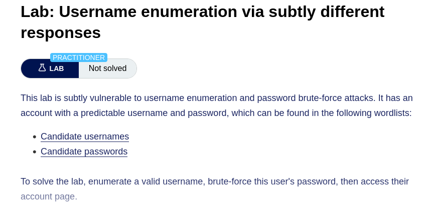
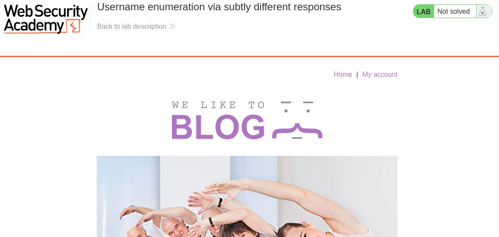
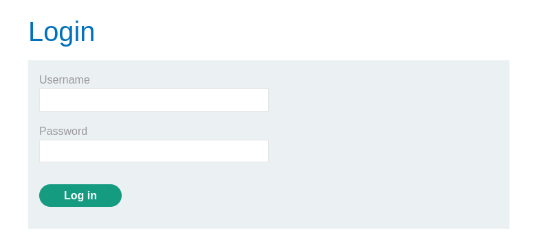
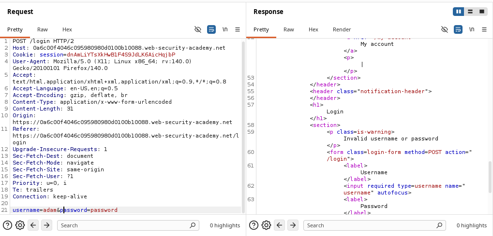
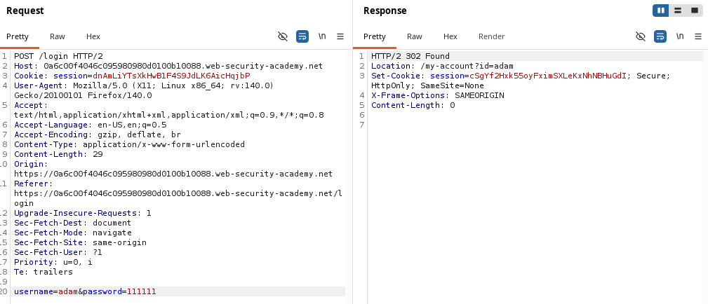
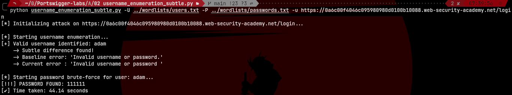
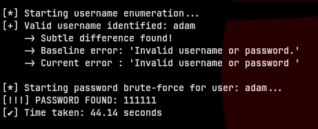
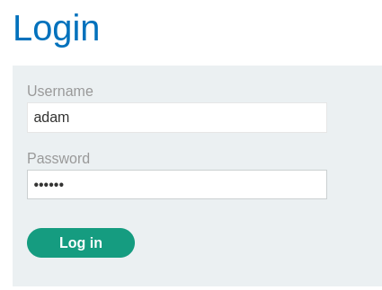
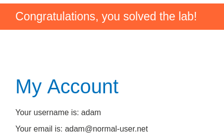

# Username Enumeration via Subtly Different Responses

> PortSwigger Web Security Academy 


## Description



This lab is vulnerable to username enumeration and password brute-force attacks, but it employs defense mechanisms to thwart basic automated tools. The application attempts to use a generic "Invalid username or password" message for all failed logins. However, it contains a subtle flaw: when a valid username is submitted, the error message changes slightly (e.g., a missing period at the end of the sentence).

Furthermore, the server injects dynamic, random content into the HTML of every response to randomize the `Content-Length`. This is an intentional trap designed to break enumeration scripts that rely on finding anomalies by measuring the overall size of the HTTP response.




---

## How the vulnerability works

The attack bypasses the server's defenses using a two-phase approach, utilizing Regular Expressions (Regex) to isolate the exact error message from the DOM:

### Phase 1: Username Enumeration (The Baseline Technique)
Since we cannot rely on the overall response length, we must establish a "Baseline".
1. We send a guaranteed invalid username (e.g., `user_does_not_exist_999`).
2. We use a Regex pattern to extract *only* the text inside the error paragraph (`<p class="is-warning">`). This isolated text becomes our baseline.
3. We iterate through the username wordlist, extracting the error message for each attempt.
4. If an extracted error message differs *in any way* from our baseline (e.g., a missing punctuation mark), we have identified the valid user. The dynamic length of the rest of the page is completely ignored.



### Phase 2: Password Brute-forcing
Once the valid username is captured, we lock it in and iterate through a password dictionary. We observe the HTTP status codes:
- **Incorrect password** → Returns a `200 OK` with the login form and an error message.
- **Correct password** → Returns a `302 Found` redirecting the user to their account page.



---

## Script

The `username_enumeration_subtle.py` script automates both phases of the attack. 

*Note on authorship: The base structure, HTTP session handling, and request logic were developed by me. The Regex-based DOM extraction logic and the baseline concept were adapted with AI assistance to overcome the specific dynamic-length defenses introduced in this lab.*

**Key Features:**
1. **Dynamic Length Bypass:** Uses the `re` module to parse the HTML DOM and extract only the relevant error message, completely ignoring server-side character padding.
2. **Automated Two-Step Logic:** Seamlessly transitions from enumeration to brute-forcing.
3. **Clean Output:** Utilizes ANSI escape codes (`\033[K`) to prevent string overlap in the terminal, providing a clean, real-time progress update.

**Usage:**
```bash
python username_enumeration_subtle.py -U <USERNAMES_FILE> -P <PASSWORDS_FILE> -u <TARGET_URL> 
```

| Flag | Description | Default |
|------|-------------|---------|
| `-u` | Target URL (e.g., `https://<id>.web-security-academy.net/login`) | required |
| `-U` | Path to the usernames wordlist | required |
| `-P` | Path to the passwords wordlist | required |





---

## Result




---

## Requirements

```bash
pip install requests
