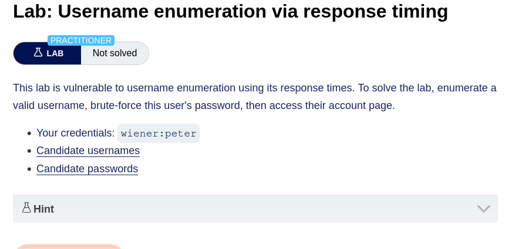
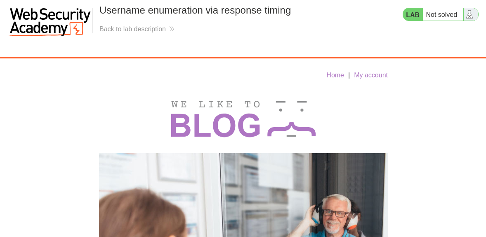
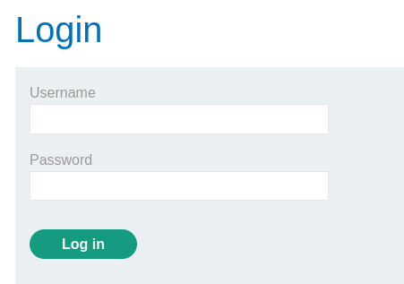
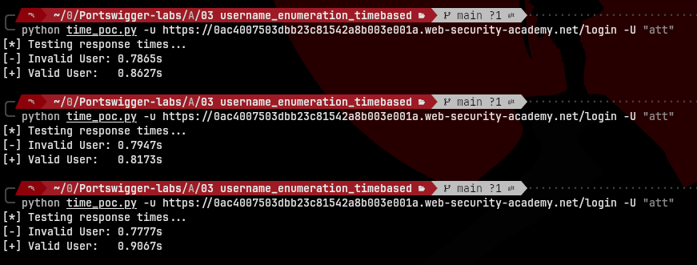
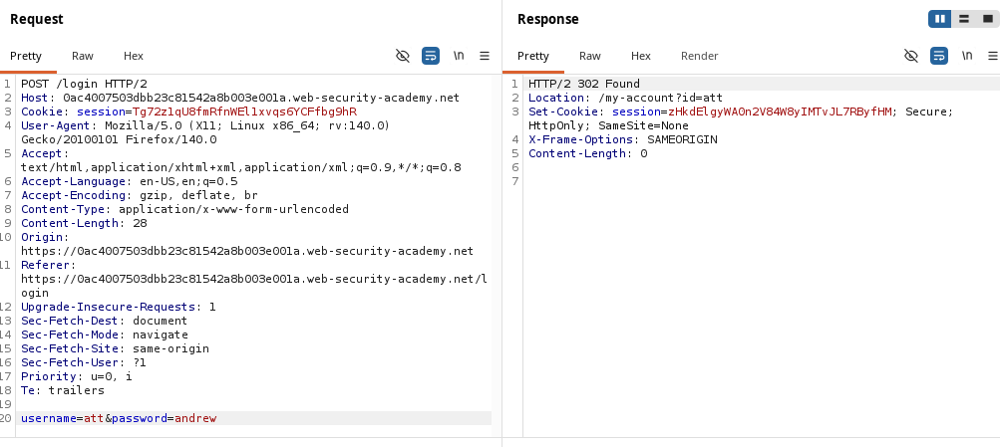
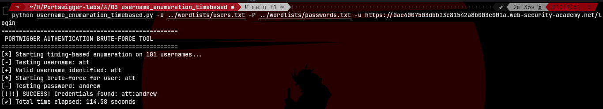
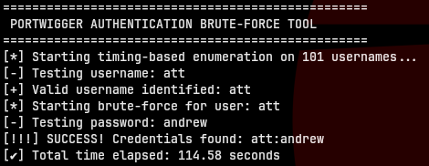
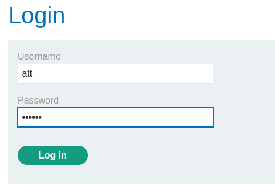
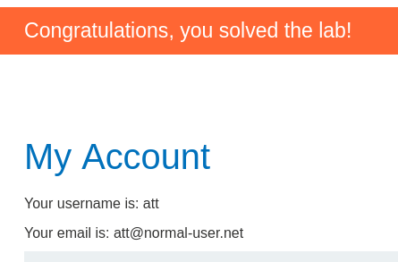

# Username Enumeration via Response Timing

> **Lab by:** PortSwigger Web Security Academy 


## Description


This lab is vulnerable to username enumeration based on the response time of the server. Additionally, the application implements a defense mechanism that blocks the user's IP address after a small number of failed login attempts, making traditional brute-force tools ineffective.

The vulnerability lies in the server's backend logic: it only performs a CPU-intensive password-hashing algorithm if the username provided exists in the database. This creates a measurable **time discrepancy** between valid and invalid usernames.





---

## How the Vulnerability Works

The attack bypasses the server's rate-limiting and identifies the target user by utilizing two high-level techniques:

### Phase 1: IP Rotation (The Bypass)
To prevent being blocked, the script injects the `X-Forwarded-For` header in every request. By generating a **randomized IP address** for each attempt, the server's security filter is deceived into treating each request as if it originated from a different client.

### Phase 2: Timing Oracle (The Enumeration)
1. **The Probe**: We iterate through the username wordlist sending a deliberately long password (e.g., 1000 characters).
2. **The Delay**: When an invalid username is sent, the server responds almost instantly (~100ms).
3. **The Hit**: When a **valid username** is sent, the server attempts to hash the long password, resulting in a significant delay (typically **>2 seconds**). This delay acts as our "Oracle" to confirm the user exists.

## Timing Verification (Proof of Concept)

Before building the full automation script, I performed a manual verification to confirm the **timing oracle**. By sending a large password string (1,000 characters), I forced the server's hashing algorithm to increase its processing time, making the time discrepancy between a valid and an invalid user clearly measurable.

### Usage:
```bash
python3 time_poc.py -u <TARGET_URL> -U <VALID_USERNAME>
```

| Flag | Description | Default |
|------|-------------|---------|
| `-u` | Target URL (e.g., `https://<id>.web-security-academy.net/login`) | required |
| `-U` | Path to the usernames wordlist | required |




### Phase 3: Password Brute-forcing
Once the username is locked, the script switches to a standard dictionary attack. Since we are still rotating the IP via headers, the account lockout remains bypassed until the `302 Found` status code indicates a successful login.



---

## The Script: `username_enumeration_timebased.py`

This script is a customized automation tool designed to handle the specific timing and rate-limiting challenges of this lab.

### Key Features:
* **Header Spoofing**: Automatic generation of random IPs for `X-Forwarded-For` rotation.
* **Precision Timing**: Uses `response.elapsed.total_seconds()` to capture server-side processing time accurately, ignoring network latency.
* **Clean Terminal UI**: Progress is displayed on a single line using ANSI escape codes to maintain a professional workspace.

### Usage:
```bash
python3 username_enumeration_timebased.py -u <TARGET_URL> -U usernames.txt -P passwords.txt
```

| Flag | Description | Default |
|------|-------------|---------|
| `-u` | Target URL (e.g., `https://<id>.web-security-academy.net/login`) | required |
| `-U` | Path to the usernames wordlist | required |
| `-P` | Path to the passwords wordlist | required |






---

## Result
Detection: The script successfully identified the anomaly in the error string despite the randomized response length.

Exploitation: The password was recovered in seconds once the user was isolated.




---

## Requirements

```bash
pip install requests
```