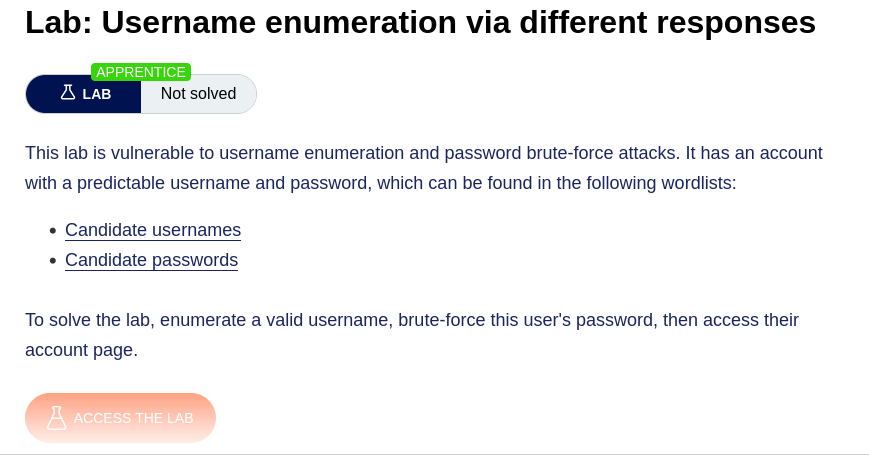
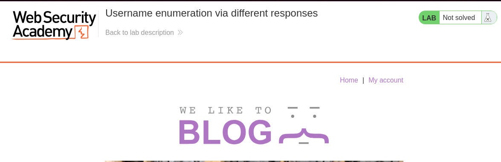
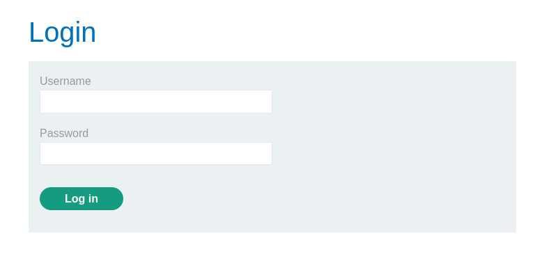
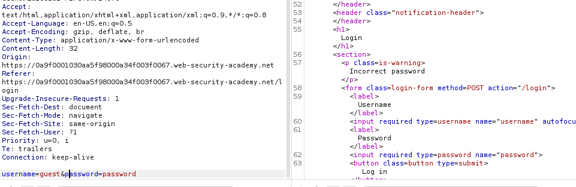
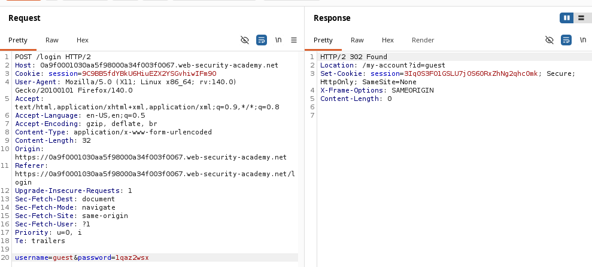
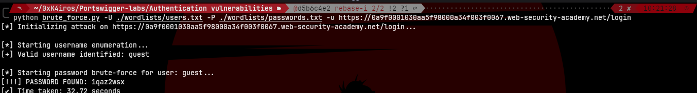
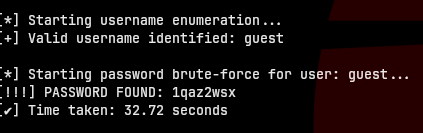
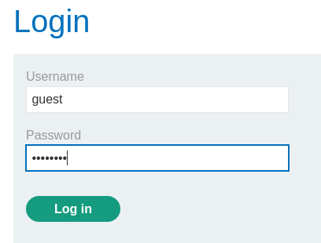
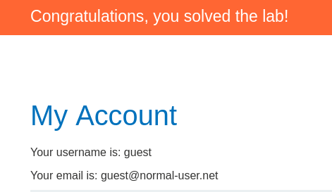

# Username Enumeration via Different Responses

> PortSwigger Web Security Academy 


## Description



This lab is vulnerable to username enumeration and password brute-force attacks. The authentication mechanism has a flaw where it returns subtly different error messages depending on whether the submitted username exists in the database or not.

The goal is to exploit this behavior to enumerate a valid username from a provided wordlist, and then use that identified username to brute-force the correct password and access the account.




---

## How the vulnerability works

The attack is executed in two distinct phases, relying on how the web application handles authentication errors and successful logins:

### Phase 1: Username Enumeration
The login form evaluates the username first. By sending a POST request with a known false password, we can observe the server's response:
- **Invalid user** → The server responds with `Invalid username`.
- **Valid user** → The server responds with `Incorrect password`.

By detecting the presence of the "Incorrect password" string in the HTML response, we can confirm which username from our dictionary actually exists in the database.



### Phase 2: Password Brute-forcing
Once the valid username is captured, we lock it in and iterate through a password dictionary. Instead of looking at text differences, we observe the HTTP status codes:
- **Incorrect password** → Returns a `200 OK` with the login form and an error message.
- **Correct password** → Returns a `302 Found` redirecting the user to their account page.



---

## Script

The `brute_force_login.py` script automates both phases of the attack seamlessly. It loads the wordlists into memory, prevents terminal visual artifacts during execution, and tracks the total time taken to crack the account.

**Key Features:**
1. **Automated Two-Step Logic:** Seamlessly transitions from enumeration to brute-forcing without manual intervention.
2. **Clean Output:** Utilizes ANSI escape codes (`\033[K`) to prevent string overlap in the terminal, providing a clean, real-time progress update.
3. **Graceful Exits:** Properly handles edge cases (e.g., exiting if no valid user is found in the provided list).

**Usage:**
```bash
python brute_force_login.py -U <USERNAMES_FILE> -P <PASSWORDS_FILE> -u <TARGET_URL> 
```

| Flag | Description | Default |
|------|-------------|---------|
| `-u` | Target URL (e.g., `https://<id>.web-security-academy.net/login`) | required |
| `-U` | Path to the usernames wordlist | required |
| `-P` | Path to the passwords wordlist | required |





---

## Result




---

## Requirements

```bash
pip install requests

