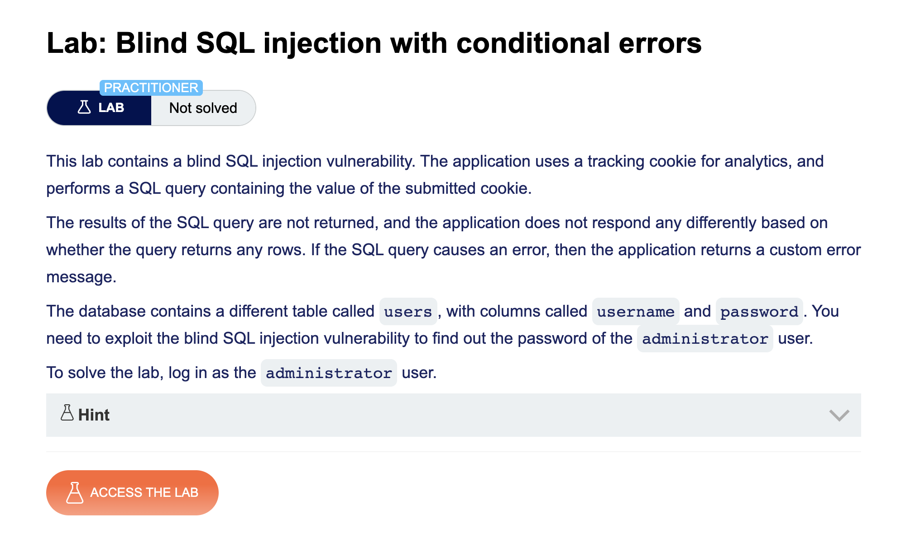
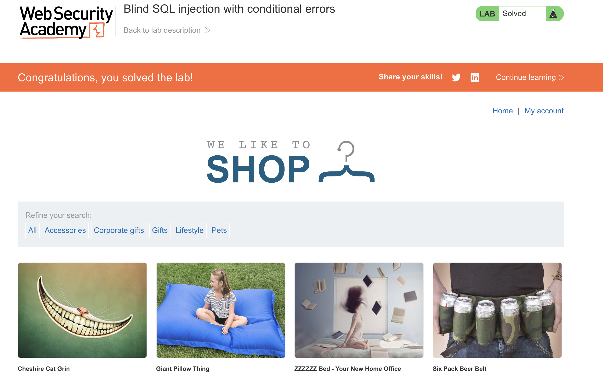
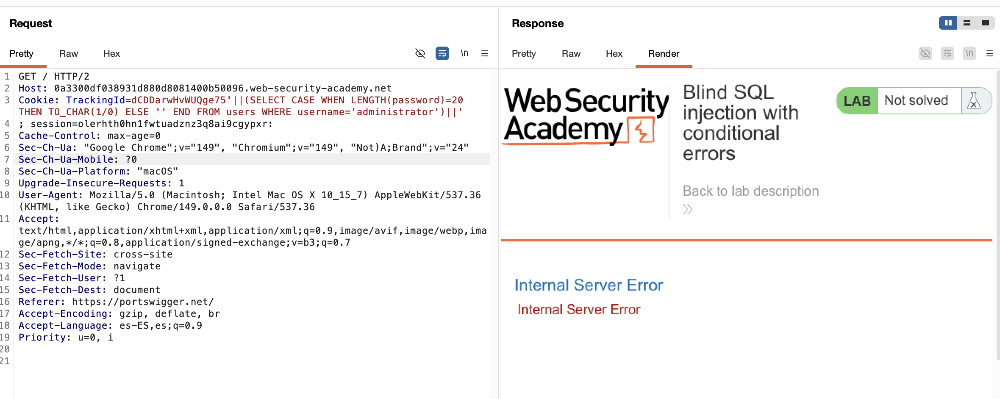
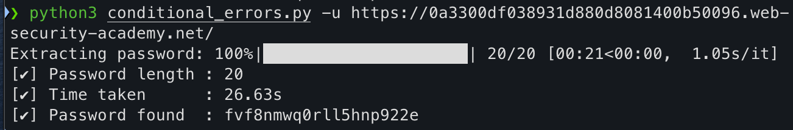
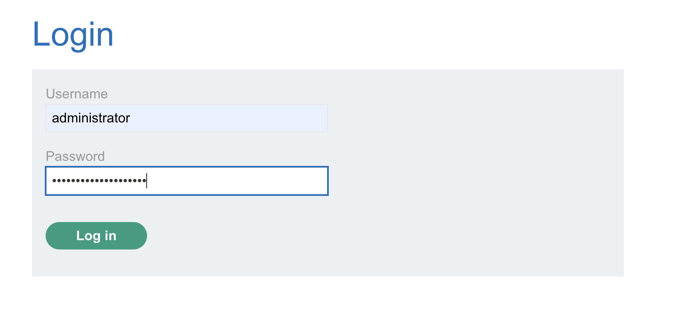
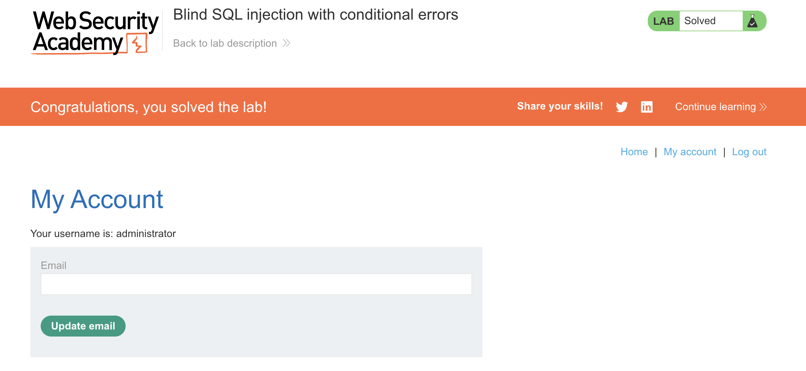

# Blind SQL Injection — Conditional Errors

> PortSwigger Web Security Academy | SQL Injection | Practitioner


## Description



This lab contains a blind SQL injection vulnerability in a tracking cookie. The application performs a SQL query using the cookie value but returns no visible boolean signal (no `Welcome back!` message, no observable content difference) — the only oracle available is whether the request triggers a database error.

The goal is to exploit this error-based oracle to extract the administrator's password character by character.



---

## How the vulnerability works

The application embeds the `TrackingId` cookie value directly into a SQL query (Oracle backend). By appending a conditional expression that forces a division-by-zero (`TO_CHAR(1/0)`) when true, it's possible to ask the database true/false questions and observe the response via HTTP status code:

- Condition **true** → `1/0` is evaluated → **HTTP 500** (Internal Server Error)
- Condition **false** → `1/0` is never evaluated → normal response

```sql
'||(SELECT CASE WHEN [condition] THEN TO_CHAR(1/0) ELSE '' END FROM users WHERE username='administrator')||'
```

The payload is injected directly inside the `TrackingId` cookie:



**Important implementation detail:** the original `TrackingId` cookie must be removed from the session before sending payload requests. Otherwise the request carries two `TrackingId` cookies (the clean one + the injected one), and the backend may silently prefer the clean value — making every request look like "false" regardless of the actual condition.

---

## Script — `conditional_errors.py`

Single script combining three optimizations over a naive linear approach:

1. **Binary search on ASCII values** — instead of iterating through every character, bisects the ASCII range (`32`–`126`) to resolve each character in O(log m) requests instead of O(m).
2. **Automatic password length detection** — binary search on `LENGTH(password)`, no hardcoded assumptions (`MAX_LENGTH = 50` as upper bound).
3. **Parallel extraction** — `ThreadPoolExecutor` resolves all character positions concurrently; each request carries its own payload via `cookies={...}` per call (never mutating a shared session cookie jar), so threads don't race on shared state.


**Usage:**
```bash
python conditional_errors.py -u <TARGET_URL> -t <THREADS>
```

| Flag | Description | Default |
|------|-------------|---------|
| `-u` | Target URL | required |
| `-t` | Number of threads | 5 |



---

## Result




---

## Requirements

```bash
pip install requests tqdm
```