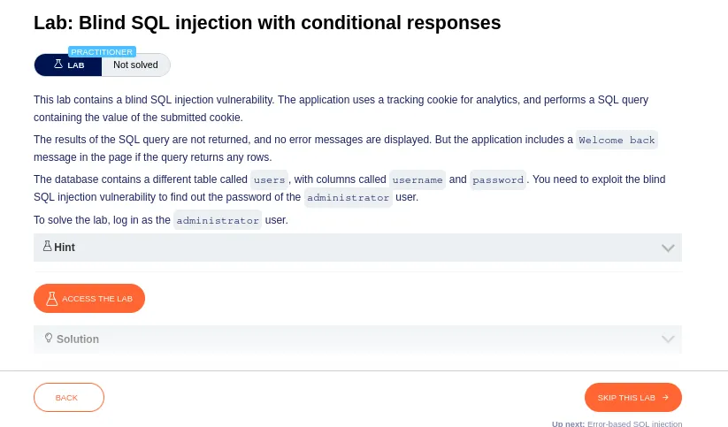
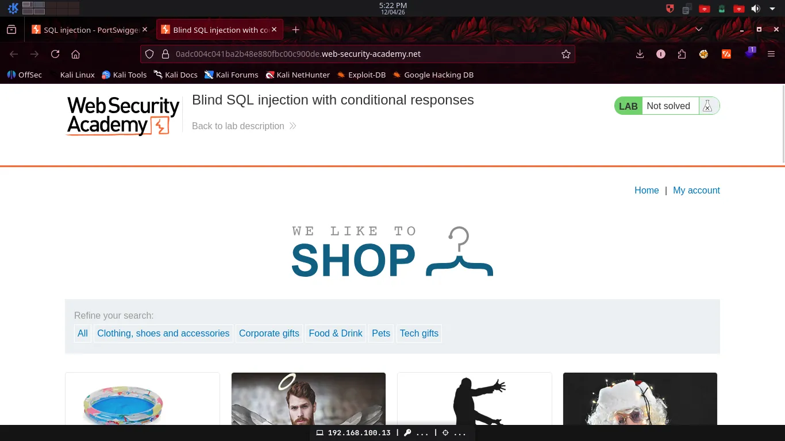
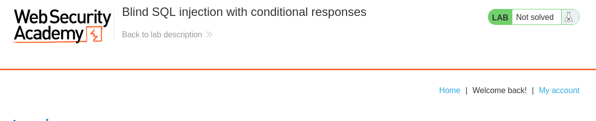
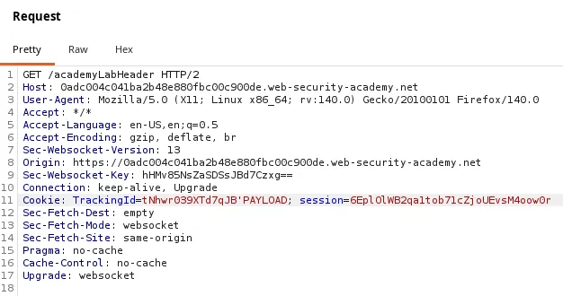
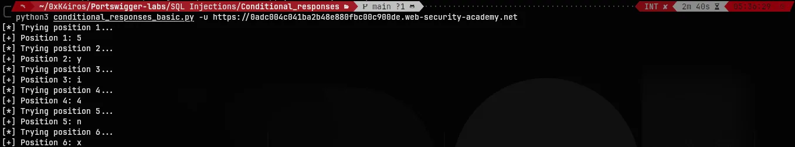
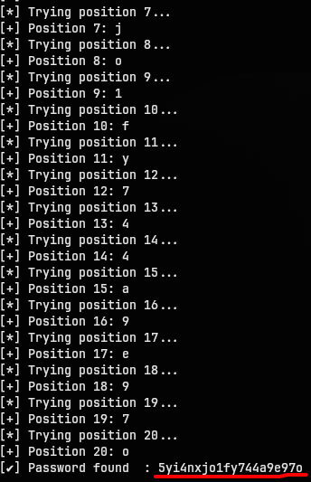
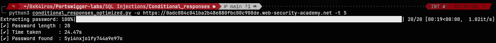
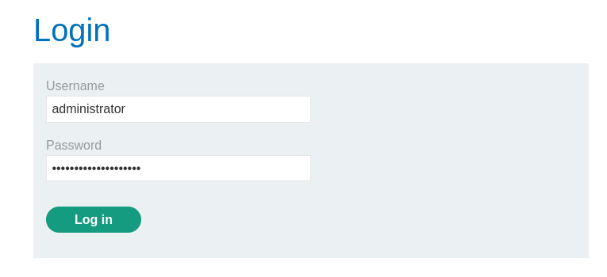
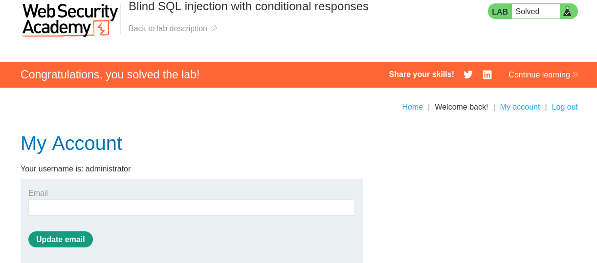

# Blind SQL Injection — Conditional Responses

> PortSwigger Web Security Academy | SQL Injection | Practitioner

> PortSwigger Web Security Academy 


## Description



This lab contains a blind SQL injection vulnerability in a tracking cookie. The application performs a SQL query using the cookie value but returns no results or errors — the only observable difference is the presence of a `Welcome back!` message when the injected condition is true.

The goal is to exploit this boolean oracle to extract the administrator's password character by character.



---

## How the vulnerability works

The application embeds the `TrackingId` cookie value directly into a SQL query. By appending a conditional expression to the cookie, it's possible to ask the database true/false questions and observe the response:

- Condition **true** → `Welcome back!` appears
- Condition **false** → `Welcome back!` is absent



The payload is injected directly inside the `TrackingId` cookie:



---

## Scripts

Two implementations are provided, each using the same boolean oracle but with different extraction strategies.

### Basic — `conditional_responses_basic.py`

Built as the initial prototype to solve the lab. Iterates linearly through a charset and compares each character against the target position in the password field.

**Complexity:** O(n × m) where n is the password length and m is the charset size.

**Known limitation:** password length is assumed to be 20 characters.

**Usage:**
```bash
python conditional_responses_basic.py -u <TARGET_URL>
```




---

### Optimized — `conditional_responses_optimized.py`

Evolved from the basic version with three improvements:

1. **Binary search on ASCII values** — instead of iterating through every character, bisects the ASCII range to find each character in O(log m) requests instead of O(m).
2. **Automatic password length detection** — binary search on the password length, no hardcoded assumptions.
3. **Parallel extraction** — `ThreadPoolExecutor` resolves all character positions concurrently, reducing total time significantly.

**Usage:**
```bash
python conditional_responses_optimized.py -u <TARGET_URL> -t <THREADS>
```

| Flag | Description | Default |
|------|-------------|---------|
| `-u` | Target URL | required |
| `-t` | Number of threads | 5 |



---

## Result




---

## Requirements

```bash
pip install requests tqdm
```